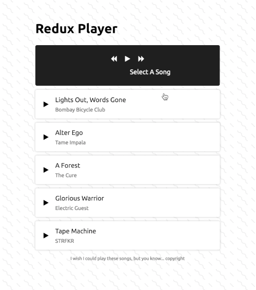

# Redux From Scratch

This repository contains source code for my [BYOR: Build Your Own Redux](https://blog.martindidiego.com/build-your-own-redux/) blog post. In this post, we’ll be exploring how Redux works at its core and then building it from the ground up to power a simple music player application.

	

## Interactive Demo

If you want to play with this code in your browser, check out the [CodeSandbox](https://codesandbox.io/s/eg3lb) for it.

## How To Run Locally

1. Install necessary dependencies by running `npm install`
2. Run locally by running `npm start`
